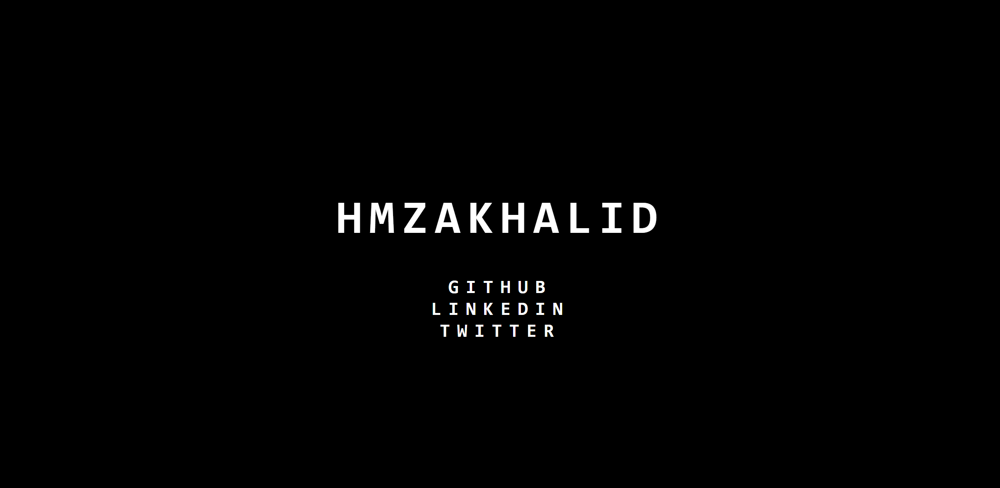

# A Webserver made in Rust

<!-- load image -->

This is a simple webserver made in Rust. It is a learning project for me to learn Rust.

## How it works

The webserver is a single-threaded webserver. It uses the `std::net` module to create a TCP listener. It then uses the `std::io` module to read and write to the TCP stream. It uses the `std::thread` module to spawn a new thread for each request. It uses the `std::sync` module to share the TCP listener between the threads.

## How to use

1. Clone the repository
2. Run `cargo run` in the root directory
3. Open a browser and go to `localhost:7878`

